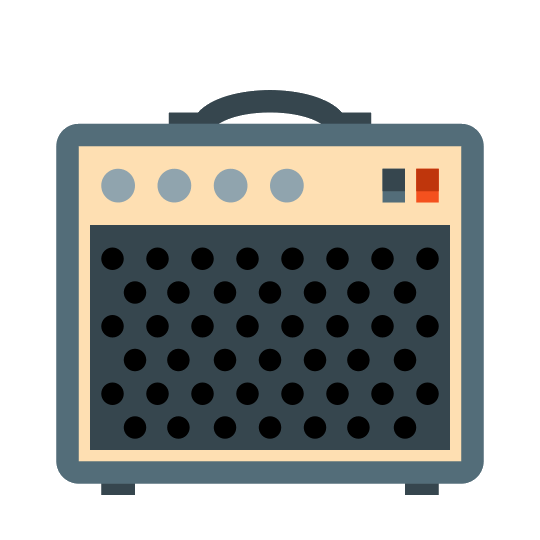

# Vagabond Practice Amp - work in progress



## Portable Practise Amp
First of all, Guitarix is pretty awesome. I use it often on Ubuntu Studio. But that's the thing. I run Studio because I can't get all the piecs working on other os. It's great for recording, but overkill for practice, and not very portable.

My goal with Vagabond is a practice amp that runs anywhere. It doesn't reqire jackd. It can't be used as a VST plugin on a daw. But it run's anywhere (that's the plan, anyway). 

* Writen in python, with C for performance, it's a low latency program.
* Uses alsa, so you can jam along with YouTube
* No expensive audio interface gear is required - I'm using a cheap microphone/headphone to usb connector - https://www.dukabel.com/product_DUSB352FB.php, with a 1/4" to 1/8" guitar cable. My Lenovo Duet has usb-c and comes with a mic/headphone to usb-c converter. This is adequate as well.

## install
```
sudo pkg install portaudio

git clone https://github.com/darkoverlordofdata/Vagabond.app.git
cd Vagabond.app
pip install -r requirements.txt
```


### icon credit
https://icon-library.com/icon/guitar-amp-icon-4.html